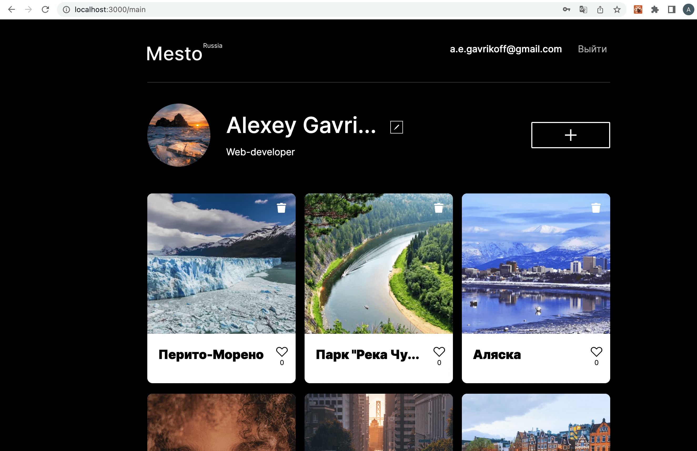

<h1 align="center">Добрый день! Вы забрели в хранилище проекта Mesto</h1>

## Ссылка на GitHub Pages
[Проект на GitHub Pages](https://methanoy.github.io/react-mesto-auth)
## Описание

<h2 align="center"></h2>

Проект переписан на React с добавлением функциона обращения к API для авторизации пользователя.

<h2 align="center">
  
</h2>

## Технологии
### HTML
- HTML5.
### CSS
- Flexbox.
- Адаптивная вёрстка.
### Framework
- React.js.
### Иное
- Методология БЭМ для разметки, CSS и построения файловой структуры проекта Nested BEM.
- Работа с макетом в Figma.
- React Hooks.
- React Router.
- работа с Rest API (авторизация пользователя, хранение данных в localStorage).
## Планы
- Добавить меню "бургер" в хедер.
