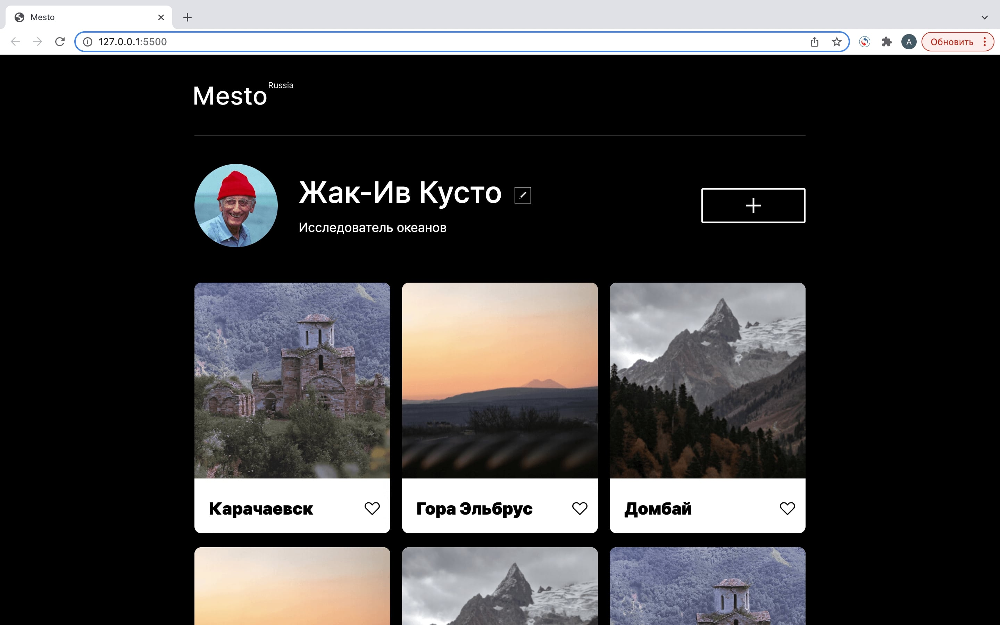

<h1 align="center">Добро пожаловать на страницу проекта Mesto</h1>

## Ссылка на GitHub Pages
[Проект на GitHub Pages](https://methanoy.github.io/mesto-react/)
## Описание

<h2 align="center"></h2>

Одностраничный сайт с редактируемыми профилем и карточками. Подготовлен в рамках курса Веб-разработчик на платформе Яндекс.Практикум.

<h2 align="center">
  
</h2>

## Технологии
### HTML
- HTML5.
### CSS
- Flexbox.
- Grid.
- Адаптивная вёрстка.
### Framework
- React JS.
### Иное
- Методология БЭМ для разметки, CSS и построения файловой структуры проекта Nested BEM.
- Работа с макетом в Figma.
- React c использованием хуков.
## Планы
- Добавить функционал валидации.